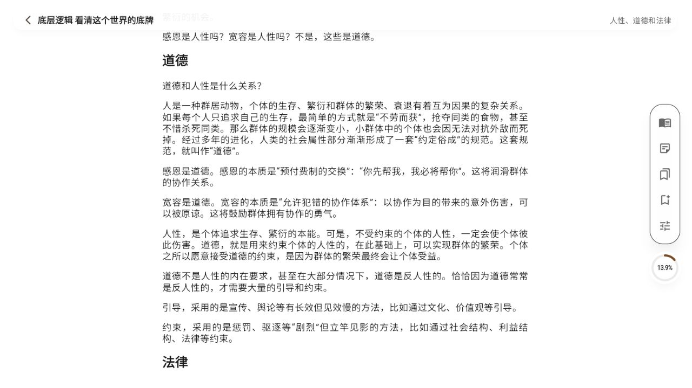
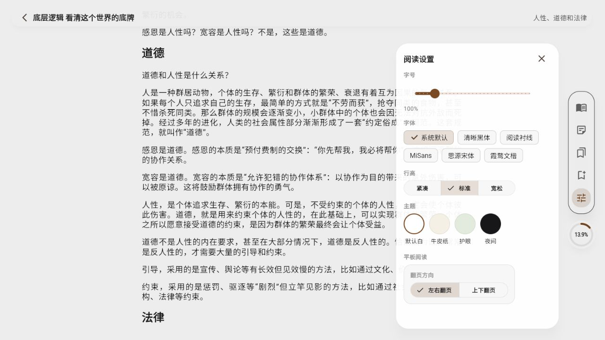
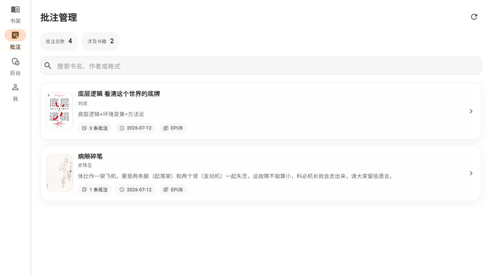
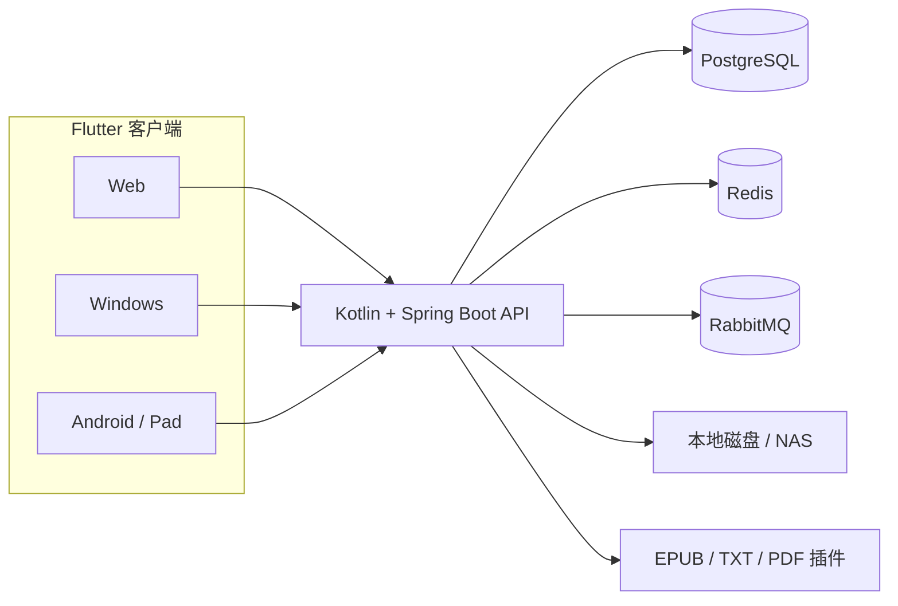

# 轻阅 · Private Reader

> 为家庭准备的轻量、自托管阅读管理器。

[English](README.en.md) · [运行文档](docs/运行文档.md) · [接口文档](docs/接口文档.md)

轻阅把散落在电脑、NAS 和家庭成员设备里的电子书整理成一个私有书库。它不是面向公众运营的内容平台，而是一套适合小家庭部署的阅读服务：管理员负责导入和整理书籍，家庭成员使用各自账号阅读，被授权的书籍、进度、书签和批注会在设备之间同步，数据始终保留在自己的服务器上。


## 为什么做轻阅

- **一个家庭书库**：集中管理 EPUB、TXT、PDF，不再依赖每台设备分别整理文件。
- **每个人有自己的阅读空间**：多人账号、逐书授权，阅读进度和笔记互不干扰。
- **自己的数据自己保存**：后端、数据库和原始书籍均可部署在家庭服务器或 NAS 旁。
- **一套界面覆盖多端**：Flutter 客户端目前可运行于 Web、Windows 和 Android，并针对平板/桌面宽屏布局适配。
- **阅读体验优先**：目录、翻页、自动滚动、书签、划线批注、主题、字号、行高和内置中文字体均可直接使用。

## 当前能力

| 范围 | 已实现能力 |
| --- | --- |
| 家庭书库 | 上传书籍、NAS/目录扫描、封面与元数据、搜索、最近阅读、来源状态 |
| 格式支持 | EPUB、TXT 统一正文；PDF 文件解析与内置 PDF 阅读能力 |
| 家庭账号 | 登录与会话恢复、管理员/普通成员、逐书授权、头像与个人设置 |
| 阅读器 | 目录跳转、滚动/翻页、阅读进度、书签、自动滚动、响应式单栏/宽屏布局 |
| 笔记 | 文本选择、划线、高亮、批注编辑、按书聚合的批注中心 |
| 个性化 | 4 套阅读主题、字号与行高、MiSans、思源宋体、霞鹜文楷 |
| 同步 | 进度、书签、批注同步；Flutter 客户端提供离线操作队列 |
| 管理后台 | 图书、成员、授权、书库来源、扫描任务、批注和书签概览 |

## 真实界面

### 沉浸式正文阅读

正文区域保持克制，点击页面中部显示工具栏，可随时打开目录、批注、书签和阅读设置。



### 适合中文阅读的排版设置

内置 MiSans、思源宋体和霞鹜文楷 Regular 字重，并提供字号、行高、主题和翻页方向设置。



### 集中管理家庭成员的阅读笔记

批注按书聚合，可搜索书名、作者或格式，快速回到对应内容。



## 技术架构



- 后端：Kotlin 2.1、Spring Boot 3.5、JDK 21
- 客户端：Flutter / Dart、Riverpod、GoRouter、Dio
- 数据与中间件：PostgreSQL 16、Redis 7、RabbitMQ 3
- 书籍解析：编译期集成的 EPUB、TXT、PDF 格式插件
- 构建路线：后端支持 JVM，并保留 GraalVM Native Image 配置

## 仓库结构

```text
reader/
├─ backend/       Kotlin + Spring Boot 多模块后端
├─ mobile/        Flutter Web / Windows / Android 客户端
├─ infra/         数据库脚本、基础设施说明和辅助脚本
├─ docs/          功能、架构、接口与运行文档
└─ docker-compose.yml
```

## 快速开始

### 1. 准备环境

- JDK 21
- Flutter（与项目当前 Dart SDK 约束兼容）
- Docker Desktop 或兼容的 Docker Compose 环境
- Windows 桌面构建需要 Visual Studio 的 Desktop development with C++ 工作负载

### 2. 启动中间件

```powershell
docker compose up -d postgres redis rabbitmq
```

默认使用 PostgreSQL `5432`、Redis `6379`、RabbitMQ `5672`，RabbitMQ 管理界面位于 `15672`。

### 3. 启动后端

```powershell
cd backend
.\gradlew.bat bootRun
```

后端默认地址为 `http://localhost:8080`，健康检查为 `http://localhost:8080/actuator/health`。

首次启动且数据库中没有用户时，会创建开发管理员：

- 用户名：`admin`
- 密码：`admin12345`

> 该账号仅用于本地首次启动。部署到家庭服务器前，请通过环境变量 `APP_BOOTSTRAP_ADMIN_USERNAME` 和 `APP_BOOTSTRAP_ADMIN_PASSWORD` 修改默认凭据。

### 4. 启动 Flutter 客户端

```powershell
cd mobile
flutter pub get
```

Web：

```powershell
flutter run -d edge --dart-define=API_BASE_URL=http://localhost:8080
```

Windows：

```powershell
flutter run -d windows --dart-define=API_BASE_URL=http://localhost:8080
```

Android 模拟器：

```powershell
flutter run -d android --dart-define=API_BASE_URL=http://10.0.2.2:8080
```

Android 真机需将 `API_BASE_URL` 换成家庭服务器或开发机的局域网地址。

## 构建与检查

```powershell
# Flutter
cd mobile
flutter analyze
flutter test
flutter build web --release --dart-define=API_BASE_URL=http://localhost:8080
flutter build windows --release --dart-define=API_BASE_URL=http://localhost:8080

# Backend
cd ..\backend
.\gradlew.bat test
.\gradlew.bat :app:bootJar
```

Web 发布产物位于 `mobile/build/web/`。浏览器页面和 API 不同源时，需要在后端部署层正确配置 CORS；HTTPS 页面也必须连接 HTTPS API。

## 部署建议

轻阅当前更适合个人或家庭内网使用：

1. 将 PostgreSQL、Redis、RabbitMQ 和后端部署在家庭服务器。
2. 把书籍存储目录挂载到后端容器或配置 NAS 扫描目录。
3. 使用 Nginx、Caddy 等反向代理统一提供 HTTPS Web 与 API 地址。
4. 修改默认管理员密码，并按家庭成员逐一创建账号和授权书籍。
5. 定期备份 PostgreSQL 数据库与书籍存储目录。

生产部署前还应根据实际网络环境补充访问控制、备份恢复和日志轮转策略。

## 文档

- [运行文档](docs/运行文档.md)
- [接口文档](docs/接口文档.md)
- [第一阶段功能总览](docs/第一阶段功能总览.md)
- [第一阶段详细功能文档](docs/第一阶段详细功能文档.md)
- [系统详细设计](docs/系统详细设计文档.md)
- [后端架构](docs/后端架构文档.md)
- [Flutter 应用架构](docs/Flutter应用架构文档.md)
- [数据库关系](docs/数据库关系文档.md)
- [基础设施说明](infra/README.md)

## 字体说明

客户端随包内置 MiSans、思源宋体和霞鹜文楷的 Regular 字重。对应许可文件位于 [`mobile/assets/fonts/`](mobile/assets/fonts/)；重新分发或制作安装包时请一并保留这些文件，并遵守各字体许可条款。

## 当前阶段

项目正在持续开发，已经可以用于家庭环境中的书库管理和跨端阅读，但仍建议先在内网部署并做好数据备份。欢迎通过 Issue 反馈实际家庭使用中的问题和需求。
