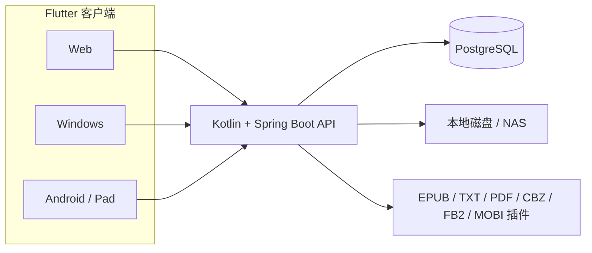

# 轻阅 · Qingyue

> 为家庭准备的轻量、自托管阅读管理器。

[English](README.en.md) · [运行文档](docs/运行文档.md) · [接口文档](docs/接口文档.md)

轻阅把散落在电脑、NAS 和家庭成员设备里的电子书整理成一个私有书库。它不是面向公众运营的内容平台，而是一套适合小家庭部署的阅读服务：管理员负责导入和整理书籍，家庭成员使用各自账号阅读，被授权的书籍、进度、书签和批注会在设备之间同步，数据始终保留在自己的服务器上。


## 功能

### 书库管理

- 支持上传书籍，以及扫描服务器本地目录、挂载目录或 NAS 书库。
- 支持 EPUB、TXT、PDF、CBZ、FB2 和 MOBI，自动提取封面、书名、作者等元数据。
- 支持搜索、最近阅读、管理分组、用户书架分组、批量编组和未分组筛选。
- 扫描单本损坏或格式不规范的书籍时会记录错误并继续任务，避免整批导入中断。

### 用户与书籍权限

- 支持管理员和普通用户，每个用户拥有独立的书架、阅读记录、进度、书签和批注。
- 新建用户默认没有任何书籍，需要由管理员逐本或批量分配阅读权限。
- 分配书籍时会将后台管理分组同步为用户书架分组；用户分组不存在时自动创建。
- 管理员可以维护用户资料、重置权限，并在验证目标管理员密码后删除其他管理员。

### 阅读与批注

- 支持目录跳转、滚动与翻页、自动滚动、阅读进度、书签和最近阅读。
- 支持文本选择、划线、高亮、批注编辑，以及按书聚合查看批注。
- 支持删除单条最近阅读记录，且不会删除对应书籍的阅读进度、书签或批注。
- EPUB、TXT、FB2、MOBI 使用统一正文阅读器，CBZ 使用漫画分页，PDF 保留固定版面。

### 阅读外观

- 提供 4 套阅读主题，并可调整字号、行高和页面显示方式。
- 内置 MiSans、思源宋体和霞鹜文楷，适合中文长时间阅读。
- 支持轻量玻璃与液态玻璃两种界面效果，并响应系统的减少动态效果设置。

### 离线缓存与同步

- 支持 EPUB、TXT、PDF、CBZ、FB2 和 MOBI 整本缓存，断网后仍可进入离线书库。
- 阅读进度、书签和批注会先保存在本机，恢复连接并登录原服务器后自动同步。
- 离线数据按服务器和用户隔离，避免多个账号之间混用阅读数据。
- 可在个人设置中清理当前设备缓存的书籍信息，不影响服务器中的原始书籍。

### 管理后台与备份

- 提供图书、分组、用户、授权、书库来源和扫描任务管理。
- 提供阅读数据、书签和批注概览，便于管理员了解书库使用情况。
- 支持完整系统备份、指定书籍备份，以及按用户或数据类型备份和恢复。
- 大型备份使用流式上传与下载，适配 Web、Windows 等不同客户端。

## 界面与多端适配

轻阅使用同一套 Flutter 客户端覆盖 Web、Windows、Android 手机和平板。手机端采用底部导航，平板和桌面宽屏采用侧边导航；书架密度、封面尺寸、按钮排列与阅读区域会根据屏幕空间和输入方式自动调整。

## 技术架构


```mermaid
flowchart LR
    subgraph Client["Flutter 客户端"]
        Web["Web"]
        Windows["Windows"]
        Android["Android / Pad"]
    end

    Web --> API
    Windows --> API
    Android --> API

    API["Kotlin + Spring Boot API"] --> PG[("PostgreSQL")]
    API --> Storage["本地磁盘 / NAS"]
    API --> Plugins["EPUB / TXT / PDF / CBZ / FB2 / MOBI 插件"]
```

- 后端：Kotlin 2.1、Spring Boot 3.5、JDK 21
- 客户端：Flutter / Dart、Riverpod、GoRouter、Dio
- 数据库：PostgreSQL 16
- 书籍解析：编译期集成的 EPUB、TXT、PDF、CBZ、FB2、MOBI 格式插件
- 构建路线：后端支持 JVM，并保留 GraalVM Native Image 配置

## 仓库结构

```text
reader/
├─ backend/       Kotlin + Spring Boot 多模块后端
├─ mobile/        Flutter Web / Windows / Android 客户端
├─ infra/         数据库脚本、基础设施说明和辅助脚本
├─ docs/          功能、架构、接口与运行文档
└─ docker-compose.yml
```

## 快速开始

### 1. 准备环境

- JDK 21
- Flutter（与项目当前 Dart SDK 约束兼容）
- Docker Desktop 或兼容的 Docker Compose 环境
- Windows 桌面构建需要 Visual Studio 的 Desktop development with C++ 工作负载

### 2. 启动数据库

```powershell
docker compose up -d postgres
```

PostgreSQL 默认使用 `5432` 端口。

### 3. 启动后端

```powershell
cd backend
.\gradlew.bat bootRun
```

后端默认地址为 `http://127.0.0.1:8080`，健康检查为 `http://127.0.0.1:8080/actuator/health`。

首次启动且数据库中没有用户时，会创建开发管理员：

- 用户名：`admin`
- 密码：`admin12345`

> 该账号仅用于本地首次启动。部署到家庭服务器前，请通过环境变量 `APP_BOOTSTRAP_ADMIN_USERNAME` 和 `APP_BOOTSTRAP_ADMIN_PASSWORD` 修改默认凭据。

### 使用 Docker Hub 镜像快速部署

发布版本提供 x86_64 和 ARM64 多架构镜像。只需安装 Docker Compose，无须在部署机器上安装 JDK、Flutter、Gradle 或编译源码。仓库根目录的 [docker-compose.quick.yml](docker-compose.quick.yml) 会启动 PostgreSQL、后端和 Web，并使用命名卷持久保存数据库与书籍文件：

```powershell
docker compose -f docker-compose.quick.yml up -d
```

启动后访问 `http://部署设备IP:3000`。默认管理员为 `admin / admin12345`，默认数据库密码为 `reader`；它们仅适合局域网试用。正式部署前请设置独立密码：

```powershell
$env:QINGYUE_ADMIN_PASSWORD = "请替换为强密码"
$env:QINGYUE_POSTGRES_PASSWORD = "请替换为另一组强密码"
docker compose -f docker-compose.quick.yml up -d
```

可通过 `QINGYUE_WEB_PORT` 修改 Web 端口，通过 `QINGYUE_BACKEND_IMAGE` 和 `QINGYUE_WEB_IMAGE` 固定或切换镜像版本。升级及查看状态：

```powershell
docker compose -f docker-compose.quick.yml pull
docker compose -f docker-compose.quick.yml up -d
docker compose -f docker-compose.quick.yml ps
```

默认镜像为 `chen584991126/qingyue-backend:v0.0.3-beta3` 和 `chen584991126/qingyue-web:v0.0.3-beta3`。快速部署文件只向宿主机开放 Web 端口，PostgreSQL 与后端仅在 Compose 网络内通信。原有 [docker-compose.yml](docker-compose.yml) 继续用于本地开发和需要直接访问后端、数据库端口的场景。

### 4. 启动 Flutter 客户端

```powershell
cd mobile
flutter pub get
```

Web：

```powershell
flutter run -d edge
```

Windows：

```powershell
flutter run -d windows
```

Android 模拟器：

```powershell
flutter run -d android --dart-define=API_BASE_URL=http://10.0.2.2:8080
```

客户端默认连接 `http://127.0.0.1:8080`。Android 真机、远程 Web 页面或连接家庭服务器时，可直接在登录页面填写实际服务器地址；地址会保存在当前设备中。Android 模拟器也可通过上面的 `API_BASE_URL` 构建参数访问宿主机。

## 构建与检查

```powershell
# Flutter
cd mobile
flutter analyze
flutter test
flutter build web --release --no-web-resources-cdn
flutter build windows --release

# Backend
cd ..\backend
.\gradlew.bat test
.\gradlew.bat :app:bootJar
```

Web 发布产物位于 `mobile/build/web/`。浏览器页面和 API 不同源时，需要在后端部署层正确配置 CORS；HTTPS 页面也必须连接 HTTPS API。

## 部署建议

轻阅当前更适合个人或家庭内网使用：

1. 将 PostgreSQL 和后端部署在家庭服务器。
2. 把书籍存储目录挂载到后端容器或配置 NAS 扫描目录。
3. 使用 Nginx、Caddy 等反向代理统一提供 HTTPS Web 与 API 地址。
4. 修改默认管理员密码，并按家庭成员逐一创建账号和授权书籍。
5. 定期备份 PostgreSQL 数据库与书籍存储目录。

生产部署前还应根据实际网络环境补充访问控制、备份恢复和日志轮转策略。

## 文档

- [运行文档](docs/运行文档.md)
- [GitHub 多端构建说明](docs/GitHub多端构建说明.md)
- [接口文档](docs/接口文档.md)
- [功能总览](docs/功能总览.md)
- [详细功能文档](docs/详细功能文档.md)
- [系统详细设计](docs/系统详细设计文档.md)
- [后端架构](docs/后端架构文档.md)
- [Flutter 应用架构](docs/Flutter应用架构文档.md)
- [数据库关系](docs/数据库关系文档.md)
- [基础设施说明](infra/README.md)

## 字体说明

客户端随包内置 MiSans、思源宋体和霞鹜文楷的 Regular 字重。对应许可文件位于 [`mobile/assets/fonts/`](mobile/assets/fonts/)；重新分发或制作安装包时请一并保留这些文件，并遵守各字体许可条款。

## 持续优化

项目以持续优化为长期目标，已经可以用于家庭环境中的书库管理和跨端阅读。后续将围绕稳定性、跨端体验、格式兼容、离线同步与管理效率持续迭代。当前仍建议优先在内网部署并做好数据备份，欢迎通过 Issue 反馈实际家庭使用中的问题和需求。
