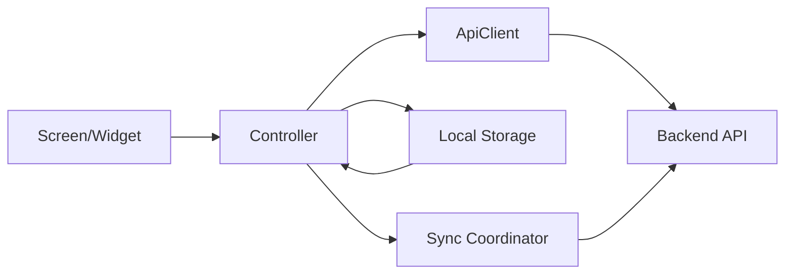

# Flutter应用架构文档

## 1. 总体定位

Flutter 应用是当前主交付前端，已覆盖手机、平板两类场景，并承担阅读器、书架、批注中心、个人中心与后台管理中心。

后续该工程也将作为 Web/Desktop 多端统一前端的基础代码库。

## 2. 目录结构

```text
mobile/lib
├─ app
├─ data
├─ features
└─ shared
```

### `app`

- 应用入口
- 路由配置
- Shell 与主导航容器

### `data`

- DTO 模型
- API 客户端
- 会话存储
- 离线队列
- 同步协调器

### `features`

- 以业务域组织页面、控制器与局部组件
- 当前包括 `auth / bookshelf / reader / annotations / admin / profile / settings`

### `shared`

- 主题 token
- 配置常量
- 响应式工具

## 3. 核心技术选型

- 状态管理：`flutter_riverpod`
- 路由：`go_router`
- 网络：`dio`
- 本地存储：`flutter_secure_storage`、`shared_preferences`、`sqflite`
- 同步辅助：`connectivity_plus`

## 4. 分层职责

### 表现层

- 由 `Screen / Widget` 组成
- 负责布局、交互、动画和响应式适配

### 控制层

- 由各 feature 下的 controller 承担
- 负责组合 API、存储与视图状态

### 数据层

- `data/models` 定义接口模型
- `data/services` 负责 HTTP、会话、配置、同步与离线任务

### 共享基础层

- `shared/theme` 统一颜色、视觉 token
- `shared/utils` 统一响应式判断
- `shared/config` 管理运行参数

## 5. 路由与壳层

### 路由

- 入口位于 `mobile/lib/app/router.dart`
- 使用 `go_router` 管理登录页、书架、阅读器、后台详情等路由

### 壳层

- 入口位于 `mobile/lib/app/app_shell.dart`
- 当前使用更安全的 `IndexedStack + Offstage` 持有各分支页面
- 叠加轻量的视觉翻页 Overlay，而不是直接对活动页面树做高风险切换动画

这一改法的目标是降低复杂导航树在平板和后台页面中的布局异常概率。

## 6. 业务模块说明

### 6.1 认证模块

- `features/auth`
- 负责登录、会话恢复、权限入口判断

### 6.2 书架模块

- `features/bookshelf`
- 展示图书列表与封面入口

### 6.3 阅读器模块

- `features/reader`
- 是当前最核心的交互模块
- 包含正文阅读、目录、章节切换、设置、书签、批注入口

当前手机端阅读器已采用：

- 顶部浮层操作栏
- 底部进度与章节栏
- `uiVisible` 驱动的淡入淡出与位移动画

### 6.4 批注模块

- `features/annotations`
- 管理阅读批注中心与局部状态通知

### 6.5 后台模块

- `features/admin`
- 当前已覆盖用户、角色、书籍、批注、资源扫描
- `admin_library_sources_section.dart` 负责扫描源与导入链路页面

### 6.6 设置与个人中心

- `features/profile`
- `features/settings`
- 负责个人页、服务器配置、阅读偏好等入口

## 7. 数据流



## 8. 响应式策略

- 手机与平板共用一套 Flutter 代码
- 通过 `Responsive` 工具做主要断点判断
- 在阅读器、后台管理、导航壳层等复杂界面中做差异化布局

## 9. 当前架构优势

- 业务分区清晰
- 读者能力与后台能力共用一个前端基座
- 便于继续向 Web/Desktop 迁移
- 对离线同步和本地存储已有基础设施沉淀

## 10. Web/Desktop 迁移建议

- 保持 `data` 和 `features` 的业务抽象不变
- 将平台差异集中收敛到 `app` 与少量 `shared` 基础设施
- 优先迁移后台与书架，再迁移阅读器中依赖平台特性的部分
- 把窗口尺寸、键盘鼠标交互、拖放上传等能力视为下一阶段的跨端增强点
