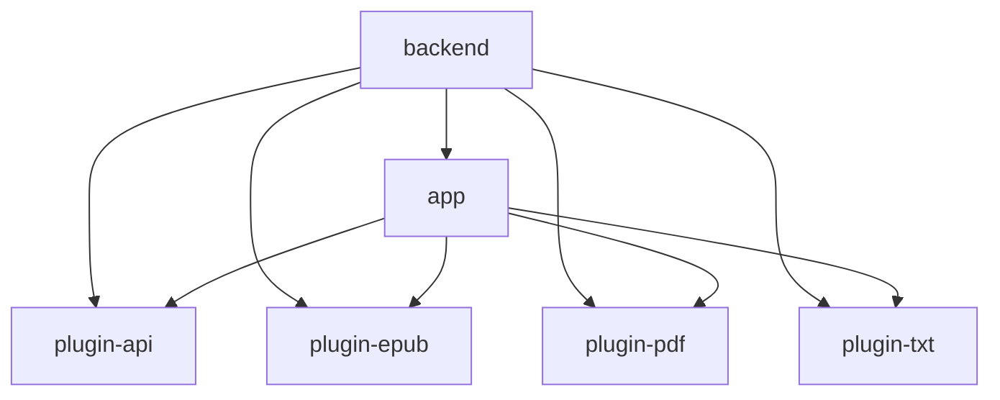
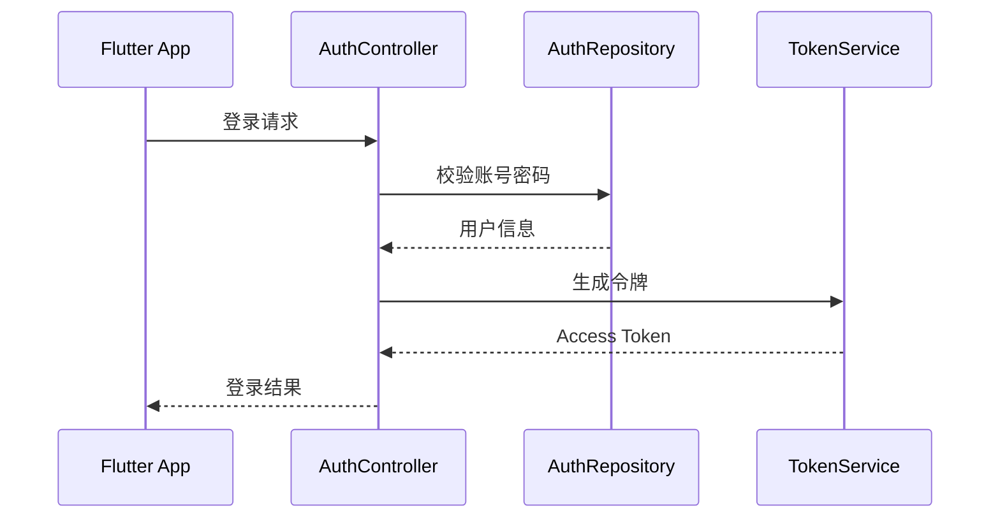
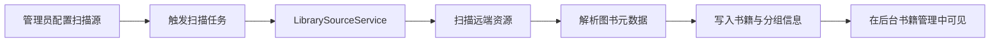

# 后端架构文档

## 1. 总体定位

后端是 Private Reader 的业务中枢，负责认证鉴权、图书元数据与正文服务、管理后台能力、同步能力，以及扫描导入能力。

技术栈以 Kotlin + Spring Boot 3 为核心，并兼顾 JVM 运行与 GraalVM Native Image 构建。

## 2. 模块结构

### `app`

- Spring Boot 主应用
- 暴露 HTTP API
- 承载业务服务、认证鉴权、同步、管理后台与扫描流程

### `plugin-api`

- 定义图书格式处理所需的公共接口

### `plugin-epub / plugin-pdf / plugin-txt`

- 提供具体格式解析能力
- 在编译期纳入主应用，而不是运行时动态加载

## 3. 包结构

主业务代码位于 `backend/app/src/main/kotlin/com/privatereader`，当前核心包如下：

- `auth`：登录、令牌、认证过滤器、用户主体
- `books`：读者侧与管理侧图书能力
- `admin`：用户管理、角色与内容管理
- `scan`：资源扫描源与扫描入库流程
- `sync`：批注、书签、阅读进度同步
- `pluginruntime`：插件注册与格式能力整合
- `config`：安全、密码、跨域、应用配置
- `common`：通用异常处理、时间等基础组件
- `bootstrap`：系统初始化与管理员引导

## 4. 分层说明

后端整体采用“控制器 + 服务 + 存储访问”风格。

### 控制器层

- 负责 API 输入输出
- 进行请求参数绑定、权限入口控制
- 典型文件：`AuthController.kt`、`AdminBookController.kt`、`LibrarySourceController.kt`

### 服务层

- 承载业务规则
- 协调数据库、插件解析、同步与管理动作
- 典型文件：`BookService.kt`、`LibrarySourceService.kt`、`SyncService.kt`

### 数据访问层

- 以 JDBC/SQL 为主
- DTO 与表结构关系显式维护
- 避免过重 ORM 带来的原生镜像复杂度

## 5. 核心业务链路

### 5.1 登录鉴权链路

### 5.2 书籍阅读链路

- App 拉取用户书架
- App 请求图书详情与正文内容
- 后端按图书格式和统一内容模型返回阅读所需数据
- 阅读进度、书签、批注通过同步接口持久化

### 5.3 扫描入库链路

## 6. 数据与中间件

### PostgreSQL

- 主业务数据存储
- 包含用户、图书、授权、批注、同步等核心表

### Redis

- 用于缓存与部分辅助状态能力

### RabbitMQ

- 为异步任务或后续可扩展的消息流保留基础设施

## 7. 安全设计

- 采用 Spring Security
- 使用 Bearer Token 进行接口鉴权
- 以角色区分普通用户、管理员、超级管理员
- 后台接口与普通读者接口分离

## 8. Native Image 友好设计

当前后端明确遵循以下原则：

- 避免运行时动态插件发现
- 避免过度依赖反射驱动框架能力
- 明确 DTO、模块边界与依赖关系
- 在构建层面提供 JVM 与 Native 双路径

## 9. 当前架构优点

- 模块边界清晰
- 图书格式能力便于继续扩展
- 面向 Flutter App 的 API 已成体系
- 对原生镜像较友好

## 10. 后续演进建议

- 将扫描任务进一步异步化与可观测化
- 补强后台统计与审计事件
- 为 Flutter Web/Desktop 统一前端补齐更稳定的 API 契约版本控制
