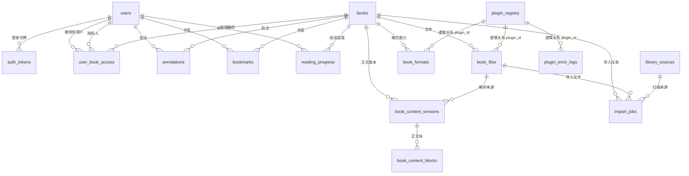

# 数据库关系文档

本文档描述当前项目后端 PostgreSQL 数据库 `private_reader` 的表结构、字段含义、约束与表关系。

生成依据：

- 运行时建表脚本：`backend/app/src/main/resources/schema.sql`
- 当前容器数据库：`books-postgres-1` / `private_reader`
- 关键业务代码：`backend/app/src/main/kotlin/com/privatereader`

连接信息：

| 项目 | 值 |
| --- | --- |
| 数据库类型 | PostgreSQL |
| Host | `localhost` |
| Port | `5432` |
| Database | `private_reader` |
| Username | `reader` |
| Password | `reader` |

## 总体关系图

说明：

- 图中 `plugin_registry` 到其他表的连线是逻辑关系，当前数据库未建立外键。
- `book_files.source_id` 与 `library_sources.id` 也是逻辑关系，当前数据库未建立外键。
- 删除 `users` 或 `books` 时，多数用户数据、书籍文件和正文数据会级联删除。
- `import_jobs` 对书籍、扫描源、文件使用 `ON DELETE SET NULL`，用于保留历史任务记录。

## 核心业务分区

| 分区 | 表 | 说明 |
| --- | --- | --- |
| 账号认证 | `users`, `auth_tokens` | 用户、角色、访问令牌和刷新令牌 |
| 书库资源 | `books`, `book_files`, `book_formats` | 书籍元数据、源文件、插件解析能力 |
| 结构化正文 | `book_content_versions`, `book_content_blocks` | 解析后的章节、段落、图片等阅读内容 |
| 权限与阅读数据 | `user_book_access`, `annotations`, `bookmarks`, `reading_progress` | 用户对书籍的访问授权、批注、书签、进度 |
| 扫描导入 | `library_sources`, `import_jobs` | 本地目录/WebDAV 扫描源与导入记录 |
| 插件运行 | `plugin_registry`, `plugin_error_logs` | 插件元信息与插件错误日志 |

## 表结构明细

### users

用户表，保存登录主体、角色和启停状态。

| 字段 | 类型 | 约束 | 默认值 | 说明 |
| --- | --- | --- | --- | --- |
| `id` | `bigint` | PK, identity, not null |  | 用户主键 |
| `username` | `varchar(120)` | unique, not null |  | 登录用户名 |
| `password_hash` | `varchar(255)` | not null |  | 密码哈希，不保存明文密码 |
| `role` | `varchar(40)` | not null |  | 用户角色，代码中支持 `SUPER_ADMIN`, `LIBRARIAN`, `READER` |
| `enabled` | `boolean` | not null | `true` | 账号是否启用 |
| `created_at` | `timestamptz` | not null |  | 创建时间 |
| `updated_at` | `timestamptz` | not null |  | 更新时间 |

关系：

- `users.id` 被 `auth_tokens.user_id`, `user_book_access.user_id`, `user_book_access.granted_by`, `annotations.user_id`, `bookmarks.user_id`, `reading_progress.user_id` 引用。
- `SUPER_ADMIN` 和 `LIBRARIAN` 在业务上拥有全局书库访问权限；`READER` 依赖 `user_book_access` 授权访问具体书籍。

### auth_tokens

认证令牌表，保存访问令牌和刷新令牌的哈希值。

| 字段 | 类型 | 约束 | 默认值 | 说明 |
| --- | --- | --- | --- | --- |
| `id` | `bigint` | PK, identity, not null |  | 令牌记录主键 |
| `user_id` | `bigint` | FK -> `users.id`, not null |  | 令牌所属用户 |
| `access_token_hash` | `varchar(128)` | unique, not null |  | Access token 哈希 |
| `refresh_token_hash` | `varchar(128)` | unique, not null |  | Refresh token 哈希 |
| `expires_at` | `timestamptz` | not null |  | Access token 过期时间 |
| `refresh_expires_at` | `timestamptz` | not null |  | Refresh token 过期时间 |
| `revoked` | `boolean` | not null | `false` | 是否已撤销 |
| `created_at` | `timestamptz` | not null |  | 创建时间 |

关系：

- `auth_tokens.user_id -> users.id`
- 删除用户时令牌级联删除。

### books

书籍主表，保存书籍级元数据。

| 字段 | 类型 | 约束 | 默认值 | 说明 |
| --- | --- | --- | --- | --- |
| `id` | `bigint` | PK, identity, not null |  | 书籍主键 |
| `title` | `varchar(255)` | not null |  | 书名 |
| `author` | `varchar(255)` | nullable |  | 作者 |
| `description` | `text` | nullable |  | 简介 |
| `created_at` | `timestamptz` | not null |  | 创建时间 |
| `updated_at` | `timestamptz` | not null |  | 更新时间 |
| `group_name` | `varchar(120)` | nullable |  | 后台维护的书籍分组名称 |

关系：

- `books.id` 被书籍文件、格式能力、正文版本、访问授权、批注、书签、阅读进度、导入任务引用。
- 删除书籍时，文件、格式、正文、授权、批注、书签和进度会级联删除；导入任务中的 `book_id` 会置空。

### book_files

书籍文件表，记录上传或扫描得到的原始文件及其存储位置。

| 字段 | 类型 | 约束 | 默认值 | 说明 |
| --- | --- | --- | --- | --- |
| `id` | `bigint` | PK, identity, not null |  | 文件主键 |
| `book_id` | `bigint` | FK -> `books.id`, not null |  | 所属书籍 |
| `plugin_id` | `varchar(120)` | not null |  | 处理该文件的插件 ID，逻辑关联 `plugin_registry.plugin_id` |
| `file_hash` | `varchar(128)` | unique, not null |  | 文件哈希，用于去重 |
| `storage_path` | `text` | not null |  | 文件在服务端存储中的路径 |
| `source_type` | `varchar(64)` | not null |  | 来源类型，如 `UPLOAD`, `WATCHED_FOLDER`, `WEBDAV` 等 |
| `source_id` | `bigint` | nullable |  | 扫描源 ID，逻辑关联 `library_sources.id` |
| `source_path` | `text` | nullable |  | 原始来源路径，例如本地文件绝对路径或 WebDAV 路径 |
| `format` | `varchar(32)` | not null |  | 文件格式/扩展名，如 `epub`, `pdf` |
| `file_size` | `bigint` | not null |  | 文件大小，单位字节 |
| `source_missing` | `boolean` | not null | `false` | 扫描源中是否已找不到该文件 |
| `created_at` | `timestamptz` | not null |  | 创建时间 |
| `updated_at` | `timestamptz` | not null |  | 更新时间 |

关系：

- `book_files.book_id -> books.id`
- `book_content_versions.source_file_id -> book_files.id`
- `import_jobs.file_id -> book_files.id`
- 删除书籍或文件时，对应结构化正文版本会级联删除；导入任务中的 `file_id` 会置空。

### book_formats

书籍格式能力表，保存插件对某本书某种格式的解析能力和展示清单。

| 字段 | 类型 | 约束 | 默认值 | 说明 |
| --- | --- | --- | --- | --- |
| `id` | `bigint` | PK, identity, not null |  | 格式记录主键 |
| `book_id` | `bigint` | FK -> `books.id`, not null |  | 所属书籍 |
| `plugin_id` | `varchar(120)` | not null |  | 提供能力的插件 ID，逻辑关联 `plugin_registry.plugin_id` |
| `format` | `varchar(32)` | not null |  | 文件格式 |
| `capabilities_json` | `text` | not null |  | 插件能力 JSON，如可在线阅读、可提取目录等 |
| `manifest_json` | `text` | nullable |  | 插件生成的书籍 manifest JSON |
| `online_readable` | `boolean` | not null | `false` | 是否支持在线阅读 |
| `index_excerpt` | `text` | nullable |  | 索引/摘要文本，用于列表或搜索展示 |
| `created_at` | `timestamptz` | not null |  | 创建时间 |
| `updated_at` | `timestamptz` | not null |  | 更新时间 |

关系：

- `book_formats.book_id -> books.id`
- 删除书籍时格式能力记录级联删除。

### book_content_versions

结构化正文版本表，保存每次解析生成的正文版本。

| 字段 | 类型 | 约束 | 默认值 | 说明 |
| --- | --- | --- | --- | --- |
| `id` | `bigint` | PK, identity, not null |  | 正文版本主键 |
| `book_id` | `bigint` | FK -> `books.id`, not null |  | 所属书籍 |
| `source_file_id` | `bigint` | FK -> `book_files.id`, not null |  | 解析所用源文件 |
| `content_model` | `varchar(64)` | not null |  | 正文模型，当前代码使用 `UNIFIED_V1` |
| `status` | `varchar(32)` | not null |  | 版本状态，当前代码使用 `READY`, `FAILED`, `STALE` |
| `checksum` | `varchar(128)` | not null |  | 正文内容校验值 |
| `created_at` | `timestamptz` | not null |  | 创建时间 |
| `updated_at` | `timestamptz` | not null |  | 更新时间 |

关系：

- `book_content_versions.book_id -> books.id`
- `book_content_versions.source_file_id -> book_files.id`
- `book_content_blocks.content_version_id -> book_content_versions.id`
- 删除书籍或源文件时正文版本级联删除；删除正文版本时正文块级联删除。

### book_content_blocks

结构化正文块表，保存章节内的段落、标题、图片等内容块。

| 字段 | 类型 | 约束 | 默认值 | 说明 |
| --- | --- | --- | --- | --- |
| `id` | `bigint` | PK, identity, not null |  | 正文块主键 |
| `content_version_id` | `bigint` | FK -> `book_content_versions.id`, not null |  | 所属正文版本 |
| `chapter_index` | `integer` | not null |  | 章节序号 |
| `block_index` | `integer` | not null |  | 章节内块序号 |
| `block_type` | `varchar(32)` | not null |  | 内容块类型，如标题、段落、图片等 |
| `anchor` | `varchar(255)` | not null |  | 阅读定位锚点 |
| `text` | `text` | not null |  | 原始/渲染文本内容 |
| `plain_text` | `text` | not null |  | 纯文本内容，用于搜索、摘要或同步 |
| `meta_json` | `text` | nullable |  | 块附加元数据 JSON，例如图片信息 |
| `created_at` | `timestamptz` | not null |  | 创建时间 |

关系：

- `book_content_blocks.content_version_id -> book_content_versions.id`
- 正文块按 `(content_version_id, chapter_index, block_index)` 排序读取。

### user_book_access

用户书籍授权表，用于记录普通读者对具体书籍的访问权限。

| 字段 | 类型 | 约束 | 默认值 | 说明 |
| --- | --- | --- | --- | --- |
| `user_id` | `bigint` | PK, FK -> `users.id`, not null |  | 被授权用户 |
| `book_id` | `bigint` | PK, FK -> `books.id`, not null |  | 被授权书籍 |
| `granted_by` | `bigint` | FK -> `users.id`, not null |  | 授权操作人 |
| `granted_at` | `timestamptz` | not null |  | 授权时间 |

关系：

- 复合主键：`(user_id, book_id)`，同一用户对同一本书只能有一条授权。
- `user_id` 删除时级联删除授权。
- `book_id` 删除时级联删除授权。
- `granted_by` 引用 `users.id`，删除授权人时数据库默认 `NO ACTION`，需要先处理授权记录。

### annotations

批注表，保存用户在书籍中的划线、摘录和笔记。

| 字段 | 类型 | 约束 | 默认值 | 说明 |
| --- | --- | --- | --- | --- |
| `id` | `bigint` | PK, identity, not null |  | 批注主键 |
| `user_id` | `bigint` | FK -> `users.id`, not null |  | 批注所属用户 |
| `book_id` | `bigint` | FK -> `books.id`, not null |  | 批注所属书籍 |
| `quote_text` | `text` | nullable |  | 被摘录/划线的原文 |
| `note_text` | `text` | nullable |  | 用户笔记 |
| `color` | `varchar(32)` | nullable |  | 批注颜色 |
| `anchor_json` | `text` | not null |  | 阅读定位信息 JSON |
| `version` | `integer` | not null |  | 客户端同步版本号 |
| `deleted` | `boolean` | not null | `false` | 软删除标记 |
| `created_at` | `timestamptz` | not null |  | 创建时间 |
| `updated_at` | `timestamptz` | not null |  | 更新时间 |

关系：

- `annotations.user_id -> users.id`
- `annotations.book_id -> books.id`
- 删除用户或书籍时批注级联删除。
- 客户端删除批注时通常设置 `deleted = true`，用于同步软删除。

### bookmarks

书签表，保存用户在书籍中的阅读位置标记。

| 字段 | 类型 | 约束 | 默认值 | 说明 |
| --- | --- | --- | --- | --- |
| `id` | `bigint` | PK, identity, not null |  | 书签主键 |
| `user_id` | `bigint` | FK -> `users.id`, not null |  | 书签所属用户 |
| `book_id` | `bigint` | FK -> `books.id`, not null |  | 书签所属书籍 |
| `location` | `text` | not null |  | 阅读位置，通常是章节/锚点/偏移信息 |
| `label` | `varchar(255)` | nullable |  | 书签名称或备注 |
| `deleted` | `boolean` | not null | `false` | 软删除标记 |
| `created_at` | `timestamptz` | not null |  | 创建时间 |
| `updated_at` | `timestamptz` | not null |  | 更新时间 |

关系：

- `bookmarks.user_id -> users.id`
- `bookmarks.book_id -> books.id`
- 删除用户或书籍时书签级联删除。

### reading_progress

阅读进度表，保存每个用户每本书的最新阅读进度。

| 字段 | 类型 | 约束 | 默认值 | 说明 |
| --- | --- | --- | --- | --- |
| `user_id` | `bigint` | PK, FK -> `users.id`, not null |  | 用户 |
| `book_id` | `bigint` | PK, FK -> `books.id`, not null |  | 书籍 |
| `location` | `text` | not null |  | 最新阅读位置 |
| `progress_percent` | `double precision` | not null |  | 阅读百分比 |
| `updated_at` | `timestamptz` | not null |  | 更新时间 |

关系：

- 复合主键：`(user_id, book_id)`，每个用户对每本书只保存一条最新进度。
- 删除用户或书籍时进度级联删除。

### library_sources

书库扫描源表，保存本地目录或 WebDAV 等来源配置。

| 字段 | 类型 | 约束 | 默认值 | 说明 |
| --- | --- | --- | --- | --- |
| `id` | `bigint` | PK, identity, not null |  | 扫描源主键 |
| `name` | `varchar(255)` | not null |  | 扫描源名称 |
| `root_path` | `text` | not null |  | 根路径；本地目录为目录路径，WebDAV 为规范化远程路径 |
| `enabled` | `boolean` | not null | `true` | 是否启用自动扫描 |
| `source_type` | `varchar(64)` | not null |  | 来源类型，当前代码支持 `WATCHED_FOLDER`, `WEBDAV` |
| `last_scan_at` | `timestamptz` | nullable |  | 最近一次扫描开始时间 |
| `created_at` | `timestamptz` | not null |  | 创建时间 |
| `updated_at` | `timestamptz` | not null |  | 更新时间 |
| `base_url` | `text` | nullable |  | WebDAV 服务地址 |
| `remote_path` | `text` | nullable |  | WebDAV 远程目录路径 |
| `username` | `varchar(255)` | nullable |  | WebDAV 用户名 |
| `password` | `text` | nullable |  | WebDAV 密码或凭证 |
| `scan_interval_minutes` | `integer` | not null | `60` | 自动扫描间隔，单位分钟 |

关系：

- `import_jobs.source_id -> library_sources.id`
- `book_files.source_id` 在业务上指向 `library_sources.id`，但当前没有数据库外键。

### import_jobs

导入任务表，记录书籍导入或扫描导入的结果。

| 字段 | 类型 | 约束 | 默认值 | 说明 |
| --- | --- | --- | --- | --- |
| `id` | `bigint` | PK, identity, not null |  | 导入任务主键 |
| `book_id` | `bigint` | FK -> `books.id`, nullable |  | 导入得到或关联的书籍 |
| `source_id` | `bigint` | FK -> `library_sources.id`, nullable |  | 导入来源 |
| `file_id` | `bigint` | FK -> `book_files.id`, nullable |  | 导入得到或关联的文件 |
| `status` | `varchar(40)` | not null |  | 导入状态，当前成功写入使用 `COMPLETED` |
| `message` | `text` | nullable |  | 导入结果或错误信息 |
| `created_at` | `timestamptz` | not null |  | 创建时间 |
| `updated_at` | `timestamptz` | not null |  | 更新时间 |

关系：

- `import_jobs.book_id -> books.id ON DELETE SET NULL`
- `import_jobs.source_id -> library_sources.id ON DELETE SET NULL`
- `import_jobs.file_id -> book_files.id ON DELETE SET NULL`
- 该表偏审计/历史记录，因此关联对象删除后保留任务行。

### plugin_registry

插件注册表，保存后端已识别的插件元信息。

| 字段 | 类型 | 约束 | 默认值 | 说明 |
| --- | --- | --- | --- | --- |
| `plugin_id` | `varchar(120)` | PK, not null |  | 插件唯一 ID |
| `display_name` | `varchar(255)` | not null |  | 插件展示名称 |
| `supported_extensions_json` | `text` | not null |  | 支持扩展名列表 JSON |
| `capabilities_json` | `text` | not null |  | 插件能力 JSON |
| `updated_at` | `timestamptz` | not null |  | 最近注册或更新时间 |

关系：

- `book_files.plugin_id`, `book_formats.plugin_id`, `plugin_error_logs.plugin_id` 在业务上对应 `plugin_registry.plugin_id`。
- 当前数据库未建立这些外键，因此插件记录删除不会自动影响文件、格式和错误日志。

### plugin_error_logs

插件错误日志表，保存插件处理文件或扫描时发生的错误。

| 字段 | 类型 | 约束 | 默认值 | 说明 |
| --- | --- | --- | --- | --- |
| `id` | `bigint` | PK, identity, not null |  | 错误日志主键 |
| `plugin_id` | `varchar(120)` | not null |  | 发生错误的插件 ID，逻辑关联 `plugin_registry.plugin_id` |
| `source_path` | `text` | nullable |  | 出错文件或来源路径 |
| `error_message` | `text` | not null |  | 错误信息 |
| `created_at` | `timestamptz` | not null |  | 创建时间 |

关系：

- 当前无数据库外键。
- 适合按 `plugin_id` 和 `created_at` 排查插件运行问题。

## 外键与删除规则

| 子表字段 | 父表字段 | 删除父记录时 |
| --- | --- | --- |
| `auth_tokens.user_id` | `users.id` | `CASCADE` |
| `book_files.book_id` | `books.id` | `CASCADE` |
| `book_formats.book_id` | `books.id` | `CASCADE` |
| `book_content_versions.book_id` | `books.id` | `CASCADE` |
| `book_content_versions.source_file_id` | `book_files.id` | `CASCADE` |
| `book_content_blocks.content_version_id` | `book_content_versions.id` | `CASCADE` |
| `user_book_access.user_id` | `users.id` | `CASCADE` |
| `user_book_access.book_id` | `books.id` | `CASCADE` |
| `user_book_access.granted_by` | `users.id` | `NO ACTION` |
| `annotations.user_id` | `users.id` | `CASCADE` |
| `annotations.book_id` | `books.id` | `CASCADE` |
| `bookmarks.user_id` | `users.id` | `CASCADE` |
| `bookmarks.book_id` | `books.id` | `CASCADE` |
| `reading_progress.user_id` | `users.id` | `CASCADE` |
| `reading_progress.book_id` | `books.id` | `CASCADE` |
| `import_jobs.book_id` | `books.id` | `SET NULL` |
| `import_jobs.source_id` | `library_sources.id` | `SET NULL` |
| `import_jobs.file_id` | `book_files.id` | `SET NULL` |

## 主键、唯一约束与索引

| 表 | 约束/索引 | 字段 | 说明 |
| --- | --- | --- | --- |
| `users` | PK | `id` | 用户主键 |
| `users` | unique | `username` | 用户名唯一 |
| `auth_tokens` | PK | `id` | 令牌主键 |
| `auth_tokens` | unique | `access_token_hash` | Access token 哈希唯一 |
| `auth_tokens` | unique | `refresh_token_hash` | Refresh token 哈希唯一 |
| `books` | PK | `id` | 书籍主键 |
| `book_files` | PK | `id` | 文件主键 |
| `book_files` | unique | `file_hash` | 文件哈希唯一，防重复导入 |
| `book_formats` | PK | `id` | 格式记录主键 |
| `book_content_versions` | PK | `id` | 正文版本主键 |
| `book_content_versions` | index | `book_id, status, id desc` | 快速查询某本书最新可用正文版本 |
| `book_content_blocks` | PK | `id` | 正文块主键 |
| `book_content_blocks` | index | `content_version_id, chapter_index, block_index` | 快速按章节和块顺序读取正文 |
| `user_book_access` | PK | `user_id, book_id` | 用户与书籍授权唯一 |
| `annotations` | PK | `id` | 批注主键 |
| `bookmarks` | PK | `id` | 书签主键 |
| `reading_progress` | PK | `user_id, book_id` | 每用户每书一条进度 |
| `library_sources` | PK | `id` | 扫描源主键 |
| `import_jobs` | PK | `id` | 导入任务主键 |
| `plugin_registry` | PK | `plugin_id` | 插件 ID 唯一 |
| `plugin_error_logs` | PK | `id` | 错误日志主键 |

## 重要业务关系说明

### 用户访问书籍

- 管理类角色 `SUPER_ADMIN` 和 `LIBRARIAN` 通过代码获得全局访问权限。
- 普通读者 `READER` 需要在 `user_book_access` 中存在 `(user_id, book_id)` 授权记录。
- `user_book_access.granted_by` 记录授权操作人。

### 书籍、文件与正文版本

- `books` 是书籍聚合根。
- `book_files` 记录书籍的实际文件，同一本书可以有多个文件记录。
- `book_formats` 记录插件识别出的格式能力和 manifest。
- `book_content_versions` 记录结构化正文版本，业务查询通常取同一本书最新的 `READY` 版本。
- 新正文解析成功后，旧 `READY` 版本会被标记为 `STALE`。
- `book_content_blocks` 保存一个正文版本下的章节块数据。

### 扫描源与导入任务

- `library_sources` 保存扫描配置，当前代码支持 `WATCHED_FOLDER` 和 `WEBDAV`。
- 扫描发现文件后会写入 `book_files`，并通过 `source_id` 与 `source_path` 追踪来源。
- `import_jobs` 保存导入历史，即使书籍、文件或扫描源被删除，也通过 `SET NULL` 保留任务记录。

### 同步数据与软删除

- `annotations` 和 `bookmarks` 使用 `deleted` 字段进行软删除，便于移动端/客户端同步删除状态。
- `reading_progress` 使用 `(user_id, book_id)` 作为主键，每次更新覆盖同一用户同一本书的最新位置。

### 插件关系

- `plugin_registry` 是插件元信息来源。
- `book_files.plugin_id`, `book_formats.plugin_id`, `plugin_error_logs.plugin_id` 都依赖插件 ID，但数据库没有外键约束。
- 这意味着插件元信息删除后，历史文件、格式能力和错误日志不会被数据库自动清理。

## 维护建议

- 如果后续需要严格的数据一致性，可以考虑给 `book_files.source_id -> library_sources.id` 增加外键，删除规则建议使用 `SET NULL`。
- 如果插件 ID 需要强一致，可以考虑给 `book_files.plugin_id`, `book_formats.plugin_id`, `plugin_error_logs.plugin_id` 增加到 `plugin_registry.plugin_id` 的外键；但要先确认插件卸载时历史数据是否应保留。
- `library_sources.password` 当前是明文/可逆凭证字段语义，生产环境建议改为加密存储或引用外部密钥管理。
- `capabilities_json`, `manifest_json`, `anchor_json`, `meta_json` 当前为 `text`，如果需要数据库侧查询 JSON 字段，可以考虑迁移为 `jsonb` 并建立必要索引。
