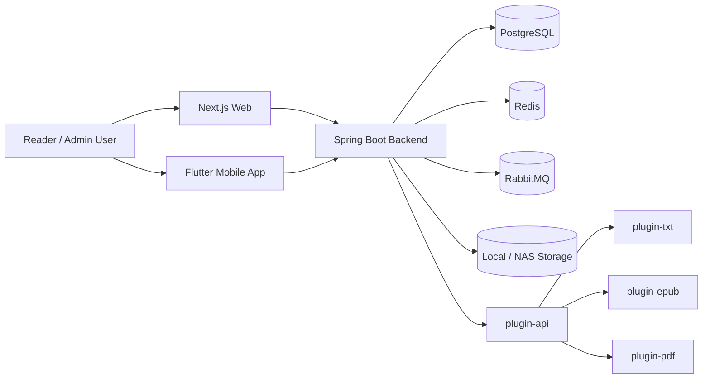
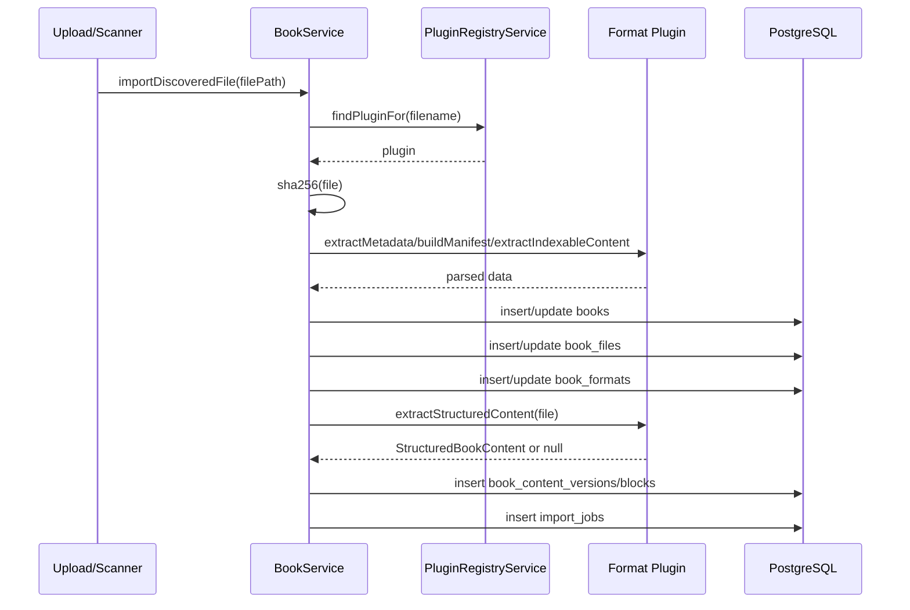
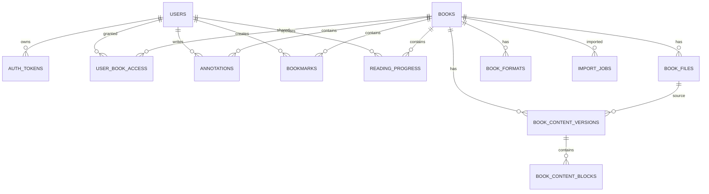

# Private Reader 系统详细设计文档

> 版本：v1.0  
> 更新时间：2026-04-20  
> 适用范围：当前仓库主干代码、已实现能力、以及已落地的统一正文第一阶段设计

---

## 1. 文档目的

本文档用于说明 Private Reader 当前系统的详细设计，包括：

- 整体技术架构与模块拆分
- 核心业务链路与数据流
- 数据库模型与关键表职责
- 后端插件化导入与统一正文设计
- Web 与 Mobile 的当前接入方式
- 安全、性能、测试、运维与后续演进建议

本文档关注的是“系统如何被设计和实现”，不是纯接口清单。接口字段级说明请参考 [接口文档](/C:/Users/mini2436/Project/Ai/Books/docs/接口文档.md)，运行方式请参考 [运行文档](/C:/Users/mini2436/Project/Ai/Books/docs/运行文档.md)。

---

## 2. 系统目标与范围

### 2.1 目标

Private Reader 的目标是构建一套可自托管、支持多用户、支持多书籍格式、支持阅读同步与后续多端扩展的电子书阅读平台。

当前阶段核心目标：

- 支持 `TXT / EPUB / PDF` 的导入、管理与在线阅读
- 支持多用户登录、授权访问、管理员后台
- 支持批注、书签、阅读进度的同步
- 支持插件式格式扩展
- 为未来 App 端提前沉淀统一正文接口，而不是把 Web 阅读器逻辑直接搬到移动端

### 2.2 当前范围

当前仓库已覆盖：

- `backend/`：Kotlin + Spring Boot 3 多模块后端
- `web/`：Next.js Web 阅读端与管理端
- `mobile/`：Flutter 移动端
- `infra/`：数据库脚本与运行辅助脚本

### 2.3 当前不在范围内

以下内容暂未作为本阶段的正式目标：

- PDF 统一正文解析与统一排版阅读
- 复杂富文本样式恢复
- 图片块、脚注回链、公式等高级正文语义
- 复杂异步任务编排系统
- 生产级分布式检索引擎
- 历史 EPUB CFI 锚点到新统一锚点的全量迁移

---

## 3. 总体架构

### 3.1 架构概览



### 3.2 架构原则

- 后端为系统事实来源，所有鉴权、授权、导入、同步、正文版本管理都在后端完成。
- 文件格式解析采用插件化设计，格式能力通过 compile-time module 注册。
- Web 与 Mobile 共享后端接口，不共享底层文件解析逻辑。
- 同步链路采用 offline-first 思路，客户端可暂存本地变更，恢复在线后再推送。
- 第一阶段结构化正文采用“并行新增，不替换旧链路”的渐进式演进方式。

---

## 4. 代码结构设计

### 4.1 顶层目录

- `backend/`：后端多模块 Gradle 工程
- `web/`：Next.js 15 Web 客户端
- `mobile/`：Flutter Android-first 客户端
- `docs/`：运行、接口、UI 设计与系统文档
- `infra/`：数据库脚本、构建脚本、运维辅助

### 4.2 后端模块

#### `backend/app`

主应用模块，负责：

- Spring Boot 启动
- REST API 暴露
- JDBC 数据访问
- 鉴权与授权
- 图书导入与文件引用管理
- 统一正文落库与读取
- 同步接口

#### `backend/plugin-api`

插件能力抽象层，定义：

- `BookFormatPlugin`
- `BookMetadata`
- `ReadingManifest`
- `IndexableContent`
- `StructuredBookContent`

该模块不依赖具体格式实现，只提供标准接口与数据模型。

#### `backend/plugin-txt`

TXT 解析插件，负责：

- 元数据提取
- manifest 生成
- 索引文本提取
- 统一正文生成

#### `backend/plugin-epub`

EPUB 解析插件，负责：

- metadata 提取
- TOC / nav / spine 解析
- cover 提取
- 索引文本提取
- 统一正文生成

#### `backend/plugin-pdf`

PDF 占位插件，当前负责：

- 基础 metadata
- 简单 manifest
- 占位索引文本

当前不生成统一正文，仍走原始文件阅读路径。

### 4.3 前端模块

#### `web/app`

使用 App Router，包含：

- 首页
- 登录页
- 阅读书架页
- 阅读器页
- 管理端页面

#### `web/components`

包含应用壳层与阅读器组件：

- `app-shell.tsx`
- `admin-shell.tsx`
- `epub-reader.tsx`
- `language-switcher.tsx`

#### `web/lib`

包含客户端共享能力：

- `api.ts`：后端接口访问
- `auth.tsx`：登录态管理
- `i18n.tsx`：国际化
- `offline-sync.ts`：离线队列与补偿同步

---

## 5. 核心业务设计

## 5.1 用户与权限模型

### 5.1.1 用户角色

当前角色包括：

- `SUPER_ADMIN`
- `LIBRARIAN`
- `READER`

### 5.1.2 权限原则

- `SUPER_ADMIN / LIBRARIAN` 默认拥有全馆访问权限
- 普通 `READER` 必须通过 `user_book_access` 获得书籍授权
- 所有 `/api/me/books/*` 接口都必须经过后端访问控制

### 5.1.3 Token 模型

认证基于 access token + refresh token：

- access token 用于 API 鉴权
- refresh token 用于续期
- token hash 持久化存储于 `auth_tokens`
- 支持主动登出与 token 撤销

---

## 5.2 图书导入设计

### 5.2.1 导入入口

当前支持两类导入入口：

- 管理端手动上传
- NAS / 本地目录扫描

统一进入 `BookService.importDiscoveredFile(...)`。

### 5.2.2 导入流程



### 5.2.3 重复导入策略

后端通过文件哈希 `file_hash` 识别重复文件。

策略如下：

- 若 `file_hash` 已存在，则复用已存在书籍
- 更新 `book_files` 的源路径与文件状态
- 重新同步 metadata / manifest / capabilities / indexExcerpt
- 若结构化正文可生成，则插入新内容版本，并将旧 `READY` 版本标记为 `STALE`

### 5.2.4 导入结果分类

导入后会形成三类结果：

1. 书籍主记录：`books`
2. 文件来源与格式能力：`book_files`、`book_formats`
3. 可选结构化正文：`book_content_versions`、`book_content_blocks`

---

## 5.3 插件系统设计

### 5.3.1 设计目标

插件系统用于解耦“文件格式差异”和“业务主流程”。后端主链路只依赖插件抽象，不依赖具体 TXT/EPUB/PDF 细节。

### 5.3.2 插件接口

`BookFormatPlugin` 当前核心方法：

- `canHandle(file: Path): Boolean`
- `extractMetadata(file: Path): BookMetadata`
- `extractCover(file: Path): CoverExtractionResult?`
- `buildManifest(file: Path): ReadingManifest?`
- `extractIndexableContent(file: Path): IndexableContent?`
- `extractStructuredContent(file: Path): StructuredBookContent?`

### 5.3.3 能力边界

#### TXT

- 可在线阅读
- 可提取全文
- 可生成统一正文
- 默认按章节标题或全文单章切分

#### EPUB

- 可在线阅读
- 可提取目录与封面
- 可提取索引文本
- 可生成统一正文
- 章节来自 `spine/nav`
- 统一阅读器锚点不直接暴露原始 CFI

#### PDF

- 当前仅保留原始文件阅读能力
- 统一正文返回 `null`
- 不参与第一阶段统一正文化

### 5.3.4 插件注册方式

当前采用 compile-time 注册方式，由 Spring 直接注入所有 `BookFormatPlugin` 实现。

优点：

- 对 GraalVM native image 更友好
- 无需运行时动态类加载
- 插件能力可直接持久化到 `plugin_registry`

---

## 5.4 统一正文设计

## 5.4.1 背景

在旧模式下：

- 后端仅存储 `metadata / manifest / capabilities / indexExcerpt`
- 阅读正文依赖 `/api/me/books/{bookId}/file` 返回原始文件
- 前端阅读器按格式分别处理 TXT / EPUB / PDF

该模式的问题是：

- App 端难以复用 Web 阅读逻辑
- 批注、进度、跳转锚点无法统一
- 不同格式阅读器行为不一致

因此系统引入第一阶段统一正文模型。

## 5.4.2 设计目标

第一阶段统一正文的目标是：

- 为 `TXT + EPUB` 提供统一的后端正文结构
- 让客户端消费结构化块，而不是解析原始文件
- 为目录、跳转、批注、搜索、进度提供统一锚点基础
- 暂不替换现有 `/file` 阅读链路

## 5.4.3 内容模型

统一正文模型当前版本固定为：

- `UNIFIED_V1`

层级结构：

```text
Book
  -> ContentVersion
    -> Chapter
      -> Block
```

### 5.4.4 版本表

`book_content_versions`

字段职责：

- `book_id`：所属书籍
- `source_file_id`：来源文件记录
- `content_model`：当前固定为 `UNIFIED_V1`
- `status`：`READY / FAILED / STALE`
- `checksum`：正文来源校验值

### 5.4.5 块表

`book_content_blocks`

字段职责：

- `chapter_index`：章节序号
- `block_index`：块序号
- `block_type`：`heading / paragraph / quote / divider`
- `anchor`：统一锚点
- `text`：显示文本
- `plain_text`：纯文本
- `meta_json`：附加属性

### 5.4.6 章节表示策略

当前实现中，每个章节会插入一个 `block_index = 0` 的合成块，用于承载：

- 章节标题
- 章节锚点
- 章节目录摘要

这样可以避免额外再建一张“章节表”，同时便于按章节快速读取。

### 5.4.7 锚点策略

第一阶段统一锚点使用后端生成的稳定文本锚点，例如：

- `chapter-0`
- `chapter-0-block-1`

设计原则：

- 不暴露格式私有定位模型给统一正文阅读器
- Web 与未来 App 使用同一套 anchor
- 历史批注锚点先兼容存量，不强制迁移

### 5.4.8 当前限制

第一阶段统一正文暂不覆盖：

- 图像块
- 表格
- 脚注来回跳转
- 粗细体/斜体等复杂 inline 样式
- EPUB 复杂 DOM 语义的完整保真恢复
- PDF 版面阅读

---

## 5.5 阅读 API 设计

### 5.5.1 现有保留接口

- `GET /api/me/books/{bookId}`
- `GET /api/me/books/{bookId}/content-manifest`
- `GET /api/me/books/{bookId}/file`
- `GET /api/me/books/{bookId}/cover`

### 5.5.2 新增统一正文接口

#### `GET /api/me/books/{bookId}/content`

返回：

- `bookId`
- `contentModel`
- `contentVersionId`
- `hasStructuredContent`
- `chapters`

用途：

- 告知客户端该书是否可以进入统一正文阅读器
- 提供目录与最新内容版本

#### `GET /api/me/books/{bookId}/content/chapters/{chapterIndex}`

返回：

- 章节标题
- 章节 anchor
- 块数组 `blocks`

用途：

- 客户端章节懒加载
- 降低单次正文响应体积

### 5.5.3 兼容策略

当前系统采用并行方案：

- `TXT + EPUB` 已具备统一正文后端能力
- Web 仍保留旧 `/file` 阅读路径
- `PDF` 明确保留原始阅读器路径

这意味着客户端可分阶段切换，不必一次性全量替换。

---

## 5.6 阅读同步设计

### 5.6.1 同步对象

同步包含三类对象：

- `annotations`
- `bookmarks`
- `reading_progress`

### 5.6.2 客户端策略

客户端通过 `offline-sync.ts` 维护本地待同步队列：

- 在线时优先直接调用接口
- 离线时将变更写入本地队列
- 恢复在线后调用 `/sync/push`
- 然后通过 `/sync/pull` 获取服务端最新状态

### 5.6.3 冲突策略

批注支持版本冲突检测：

- 客户端携带 `baseVersion`
- 服务端若发现版本落后，则返回冲突结果
- 客户端自行决定保留本地、保留服务端或另存副本

### 5.6.4 位置模型

当前阅读位置仍以字符串形式存储，如：

- `txt-page:3`
- `page:1`
- `epubcfi(...)`

后续若统一正文阅读器成为默认模式，建议逐步将：

- 阅读进度
- 书签
- 新增批注

统一收敛到新的结构化 anchor 模型。

---

## 6. 数据库详细设计

## 6.1 核心实体关系



## 6.2 主要表职责

### `users`

存储账号基础信息与角色。

### `auth_tokens`

存储 access/refresh token hash 与有效期。

### `books`

书籍主记录，存放标题、作者、简介等跨格式共享信息。

### `book_files`

存放某次导入得到的物理文件信息，包含：

- 插件归属
- 文件哈希
- 存储路径
- 来源类型
- 源路径
- 格式

### `book_formats`

存放当前书籍的格式能力与 manifest：

- `capabilities_json`
- `manifest_json`
- `index_excerpt`

该表表达的是“当前阅读格式能力摘要”，不是版本化正文。

### `book_content_versions`

存放结构化正文版本头。

### `book_content_blocks`

存放结构化正文块。

### `user_book_access`

存放书籍授权关系。

### `annotations`

存放批注与高亮。

### `bookmarks`

存放书签。

### `reading_progress`

存放每个用户每本书的最新阅读位置。

### `library_sources`

存放扫描源配置。

### `import_jobs`

存放导入作业结果与历史。

### `plugin_registry`

存放当前编译进系统的插件能力快照。

### `plugin_error_logs`

存放插件解析失败日志。

---

## 7. 前端详细设计

## 7.1 Web 总体设计

Web 当前分为两大区域：

- 阅读端
- 管理端

共享能力：

- 登录态
- 国际化
- API 客户端
- 应用壳层导航

## 7.2 阅读端页面

### 7.2.1 书架页

职责：

- 展示当前用户可访问图书
- 拉取封面
- 进入阅读器
- 显示本地离线队列规模

### 7.2.2 阅读器页

当前依然以“按格式分流”的模式运行：

- `TXT`：前端直接读取 `/file` 返回文本
- `EPUB`：前端使用 `epubjs` 渲染
- `PDF`：前端通过 iframe 加载原始文件

同时仍接入：

- 批注
- 书签
- 阅读进度
- 离线同步

### 7.2.3 统一正文接入现状

当前后端已提供统一正文 API，但 Web 默认阅读器尚未切换到该模式。

原因：

- 现阶段 UI 需要整体重设计
- 需要在新阅读器视觉与交互方案稳定后再切换默认正文消费方式

## 7.3 管理端页面

管理端提供：

- 插件状态查看
- 上传入口
- 图书目录查看
- 书籍授权
- 扫描源配置
- 导入作业查看
- 用户管理

---

## 8. Mobile 设计定位

`mobile/` 当前是 Flutter 移动端，设计目标是：

- 直接消费统一正文与同步接口
- 提供手机与平板两套响应式阅读布局
- 为后续 Android / iOS 原生能力扩展保留空间

长期建议：

- App 直接消费统一正文 API
- 不将 Web 的 EPUB/TXT 私有解析逻辑移植到移动端
- 锚点、目录、进度、批注与 Web 共享同一数据语义

---

## 9. 安全设计

## 9.1 鉴权

- 所有受保护接口基于 `Authorization: Bearer <accessToken>`
- access token 与 refresh token 采用 hash 持久化
- token 可撤销

## 9.2 授权

- 后端在 `BookService` 内统一检查书籍访问权限
- 管理角色拥有全局访问能力
- 普通读者依赖显式授权关系

## 9.3 输入与文件安全

- 插件解析受控于后端服务流程
- EPUB XML 解析已关闭外部实体，避免 XXE 风险
- 文件扩展名与插件能力匹配后才进入解析

## 9.4 未来增强建议

- 对上传文件增加 MIME 校验与大小限制
- 插件异常统一落库到 `plugin_error_logs`
- 管理端操作补充审计日志
- 生产环境接入 HTTPS、反向代理与安全头

---

## 10. 性能与容量设计

## 10.1 当前性能策略

- 书籍元数据与 manifest 在导入时预解析，降低阅读时即时开销
- 统一正文采用章节级读取，不一次性返回整本 blocks
- EPUB 索引文本只截取前部内容用于摘要

## 10.2 当前容量边界

第一阶段正文落库适合：

- TXT 全文型文本
- 中小型 EPUB

对于超大 EPUB，可能出现：

- 导入时间明显增长
- 同步导入体验变差
- 数据库存储增长较快

## 10.3 后续优化方向

- 将结构化正文生成改为异步任务
- 为 `book_content_blocks.plain_text` 增加全文检索策略
- 为章节摘要增加缓存
- 为封面与文件流增加 CDN 或对象存储能力

---

## 11. 可观测性与异常处理

## 11.1 当前机制

- API 统一异常处理由 `ApiExceptionHandler` 完成
- 参数异常返回 `400`
- 权限异常返回 `403`
- 导入作业结果写入 `import_jobs`

## 11.2 当前不足

- 缺少按插件维度的统一解析失败监控面板
- 缺少结构化正文构建失败的细粒度指标
- 缺少同步冲突统计与报警

## 11.3 建议补充

- 结构化正文构建成功率指标
- 插件失败日志聚合
- 导入耗时指标
- 同步队列堆积监控

---

## 12. 测试设计

## 12.1 后端

建议覆盖：

- TXT 结构化正文提取单测
- EPUB 结构化正文提取单测
- `BookService` 导入后结构化正文落库测试
- 重复导入版本切换测试
- 无权限正文访问测试
- PDF 回退旧链路测试

当前已补充：

- `TxtBookFormatPluginTest`
- `EpubBookFormatPluginTest`

## 12.2 前端

建议覆盖：

- 登录态保持与退出
- 书架加载与封面加载
- 阅读器不同格式分流
- 离线同步队列补偿
- 新统一正文阅读器切换逻辑

## 12.3 联调与回归

每次涉及阅读器演进，至少验证：

- `TXT + EPUB` 新书导入可读
- `PDF` 不回归
- 书签、批注、进度不丢失
- 旧书在未生成结构化正文时仍能用旧方式阅读

---

## 13. 当前阶段性结论

### 13.1 已落地

- 插件化导入主流程
- 多用户鉴权与授权
- 阅读同步
- `TXT + EPUB` 的统一正文第一阶段后端能力
- 新结构化正文数据表与读取 API

### 13.2 当前采取的关键工程决策

- 统一正文先覆盖 `TXT + EPUB`
- `PDF` 明确保留旧链路
- 新接口并行上线，不立即替换 `/file`
- 不先引入复杂任务系统
- 不先做历史锚点迁移

### 13.3 当前待推进

- 阅读端 UI 重构
- Web 统一正文阅读器正式接入
- App 端基于统一正文 API 的阅读实现
- 搜索与正文检索能力增强

---

## 14. 后续演进建议

## 14.1 短期

- 完成新阅读器 UI 设计与实现
- 为 Web 增加 `hasStructuredContent` 能力分流
- 将 `TXT + EPUB` 切到统一正文阅读器试运行

## 14.2 中期

- 扩展结构化正文搜索接口
- 将新增批注/进度统一写入结构化 anchor
- 建立结构化正文异步重建能力

## 14.3 长期

- 引入 PDF 结构化解析方案
- 统一多端阅读交互规范
- 按内容版本支持正文增量重建、检索与推荐

---

## 15. 关键文件索引

### 后端核心

- [backend/app/src/main/kotlin/com/privatereader/books/BookService.kt](/C:/Users/mini2436/Project/Ai/Private/backend/app/src/main/kotlin/com/privatereader/books/BookService.kt)
- [backend/app/src/main/kotlin/com/privatereader/books/ReaderBookController.kt](/C:/Users/mini2436/Project/Ai/Private/backend/app/src/main/kotlin/com/privatereader/books/ReaderBookController.kt)
- [backend/app/src/main/kotlin/com/privatereader/books/BookDtos.kt](/C:/Users/mini2436/Project/Ai/Private/backend/app/src/main/kotlin/com/privatereader/books/BookDtos.kt)
- [backend/app/src/main/resources/schema.sql](/C:/Users/mini2436/Project/Ai/Private/backend/app/src/main/resources/schema.sql)
- [backend/app/src/main/kotlin/com/privatereader/pluginruntime/PluginRegistryService.kt](/C:/Users/mini2436/Project/Ai/Private/backend/app/src/main/kotlin/com/privatereader/pluginruntime/PluginRegistryService.kt)

### 插件

- [backend/plugin-api/src/main/kotlin/com/privatereader/plugin/BookFormatPlugin.kt](/C:/Users/mini2436/Project/Ai/Private/backend/plugin-api/src/main/kotlin/com/privatereader/plugin/BookFormatPlugin.kt)
- [backend/plugin-api/src/main/kotlin/com/privatereader/plugin/PluginModels.kt](/C:/Users/mini2436/Project/Ai/Private/backend/plugin-api/src/main/kotlin/com/privatereader/plugin/PluginModels.kt)
- [backend/plugin-txt/src/main/kotlin/com/privatereader/plugin/txt/TxtBookFormatPlugin.kt](/C:/Users/mini2436/Project/Ai/Private/backend/plugin-txt/src/main/kotlin/com/privatereader/plugin/txt/TxtBookFormatPlugin.kt)
- [backend/plugin-epub/src/main/kotlin/com/privatereader/plugin/epub/EpubBookFormatPlugin.kt](/C:/Users/mini2436/Project/Ai/Private/backend/plugin-epub/src/main/kotlin/com/privatereader/plugin/epub/EpubBookFormatPlugin.kt)
- [backend/plugin-pdf/src/main/kotlin/com/privatereader/plugin/pdf/PdfBookFormatPlugin.kt](/C:/Users/mini2436/Project/Ai/Private/backend/plugin-pdf/src/main/kotlin/com/privatereader/plugin/pdf/PdfBookFormatPlugin.kt)

### 前端

- [web/app/app/page.tsx](/C:/Users/mini2436/Project/Ai/Private/web/app/app/page.tsx)
- [web/app/app/read/page.tsx](/C:/Users/mini2436/Project/Ai/Private/web/app/app/read/page.tsx)
- [web/components/epub-reader.tsx](/C:/Users/mini2436/Project/Ai/Private/web/components/epub-reader.tsx)
- [web/lib/offline-sync.ts](/C:/Users/mini2436/Project/Ai/Private/web/lib/offline-sync.ts)

### 相关文档

- [docs/接口文档.md](/C:/Users/mini2436/Project/Ai/Private/docs/接口文档.md)
- [docs/运行文档.md](/C:/Users/mini2436/Project/Ai/Private/docs/运行文档.md)
- [docs/app-reader-ui-spec.md](/C:/Users/mini2436/Project/Ai/Private/docs/app-reader-ui-spec.md)
